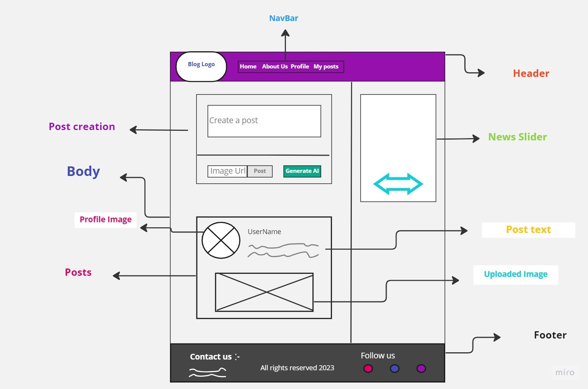
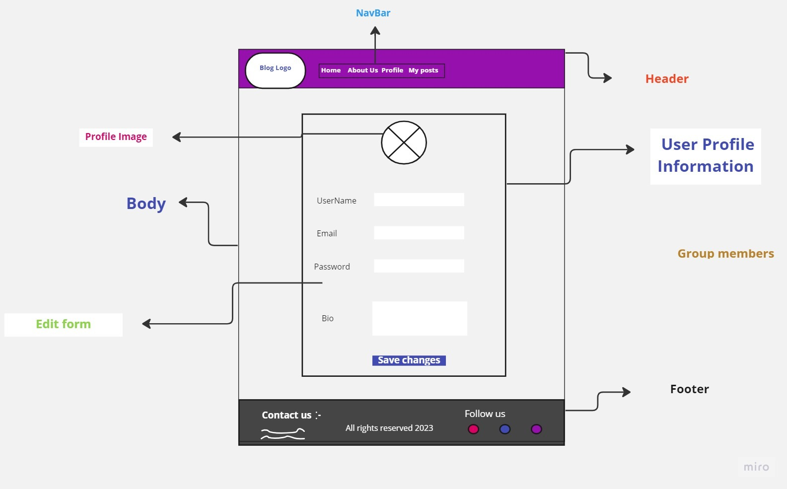
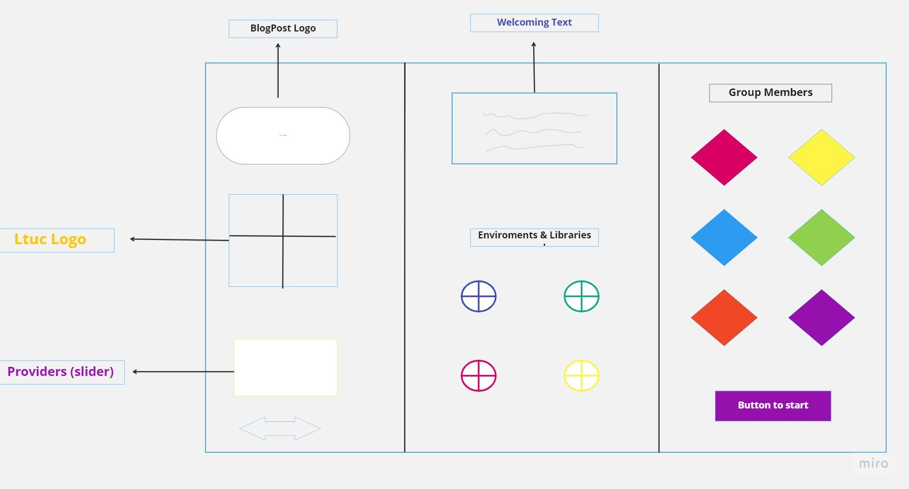
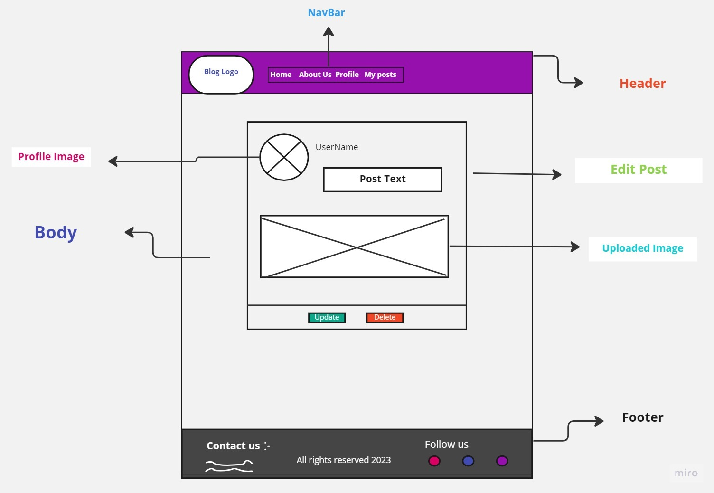
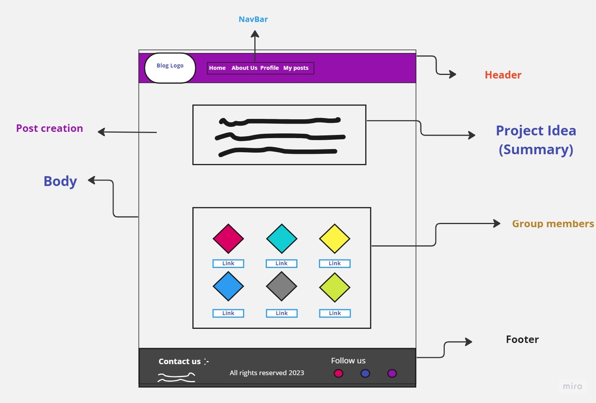

# Blogify-Backend

**This is the backend for Blogify website which is  a platform where users can post blogs with pictures, titles, and content. What makes Blogify unique is that users can optionally use GPT3 to generate content for their blog posts. This means that users can save time and effort by letting GPT3 write their content for them.**

**We used ExpressJS, NodeJS, Axios, Postgres, and CORS. This allows Blogify to handle user authentication, blog post creation and storage, and communication with external APIs.**

## [Click to see Blogify ^_^](https://main--chipper-platypus-a810ef.netlify.app/)

## The external APIs that we used:

 * https://platform.openai.com/overview

 *  https://newsapi.org/

##  [The Front-end Repo](https://github.com/DohaKhamaiseh/Blogify-Front-end)

## The Wireframes:

